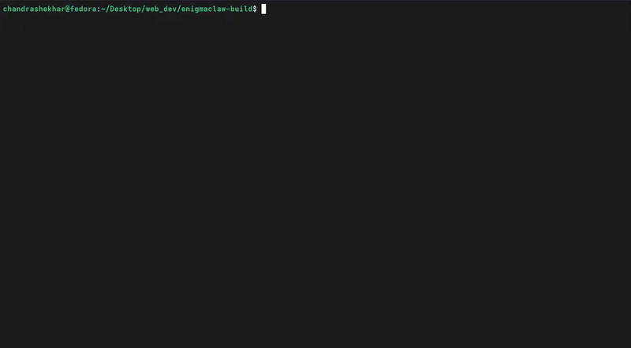

# EnigmaClaw

EnigmaClaw is an AI-powered coding agent that understands your codebase, plans development tasks, and safely performs file and tool operations using Large Language Models. Every action is tracked and executed within the configured workspace to ensure safe and transparent code modifications.

<p align="center">
  
</p>

## Features

* LLM-powered coding agent
* Read and analyze project files
* Create, modify, and delete files
* Create folders
* Execute shell commands and developer tools
* Action logging for every operation
* Workspace-safe file access
* User approval workflow for file mutations
* Built with Bun and TypeScript

## Installation

```bash
git clone https://github.com/<your-username>/enigmaclaw.git
cd enigmaclaw
bun install
```

## Environment Variables

Create a `.env` file in the project root.

```env
OPENROUTER_API_KEY=your_openrouter_api_key
OPENROUTER_MODEL=your_model
```

## Usage

```bash
bun run dev
```

## Roadmap

* [ ] Interactive CLI
* [ ] Telegram bot integration
* [ ] Git integration
* [ ] Conversation memory
* [ ] MCP tool support
* [ ] Plugin system
* [ ] Multi-agent workflows

## Contributing

Contributions are welcome. Feel free to open an issue or submit a pull request if you'd like to improve EnigmaClaw.

## License

This project is licensed under the MIT License.
